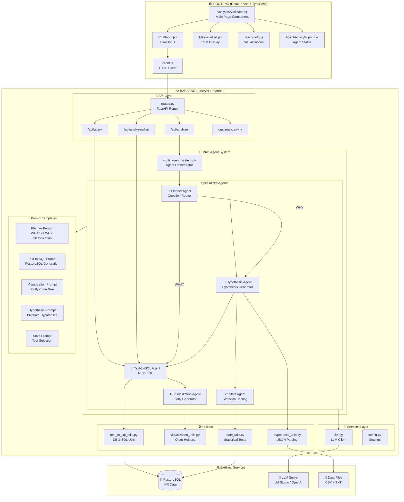
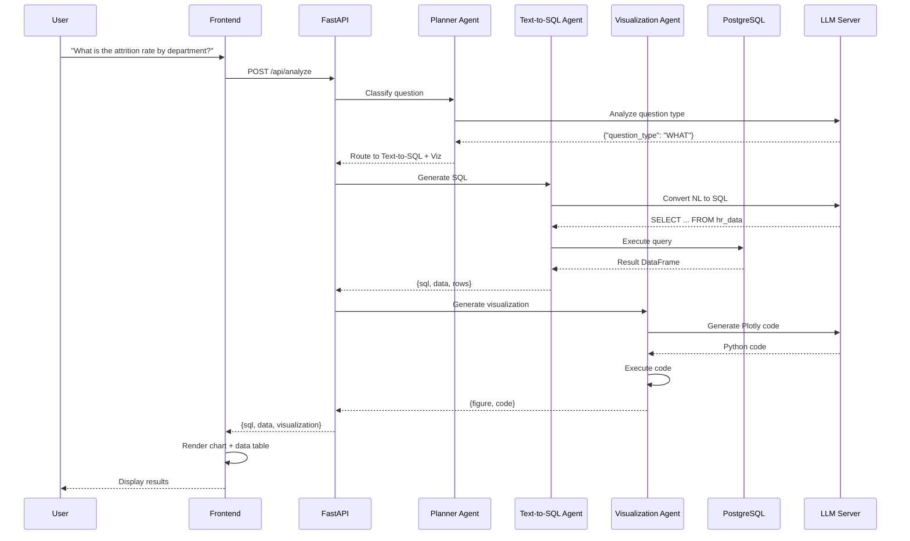
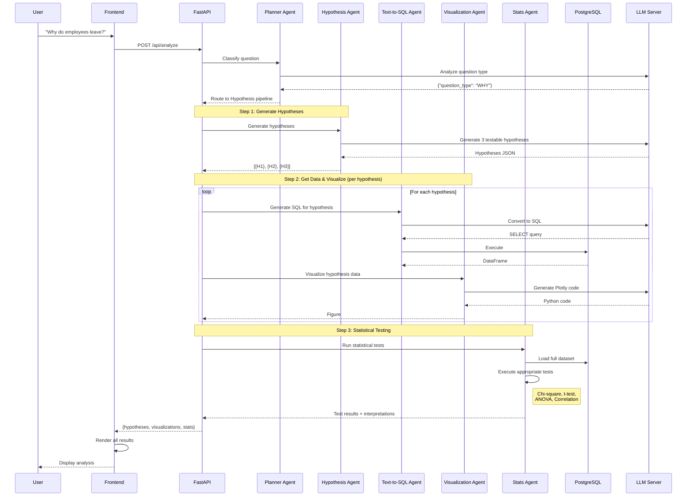
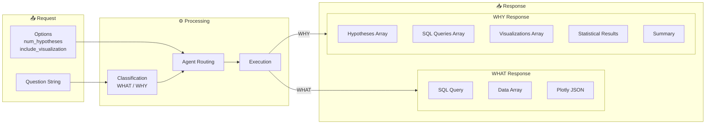

# 🏗️ Multi-Agent Analytics Assistant - System Architecture

## 📋 Table of Contents
- [Overview](#overview)
- [High-Level Architecture](#high-level-architecture)
- [System Flow Diagram](#system-flow-diagram)
- [Component Details](#component-details)
- [Agent Workflow](#agent-workflow)
- [Data Flow](#data-flow)
- [Technology Stack](#technology-stack)

---

## Overview

The **Multi-Agent Analytics Assistant** is an intelligent analytics system that uses multiple specialized AI agents to answer both **descriptive (WHAT)** and **causal (WHY)** questions about HR employee attrition data. The system automatically routes questions to the appropriate agents based on question classification.

---

## High-Level Architecture

```
┌─────────────────────────────────────────────────────────────────────────────────────────┐
│                                    FRONTEND (React + Vite)                               │
│  ┌─────────────────────────────────────────────────────────────────────────────────────┐ │
│  │                           Analytics Assistant UI                                     │ │
│  │  ┌─────────────┐  ┌──────────────┐  ┌─────────────────┐  ┌───────────────────────┐ │ │
│  │  │  Chat Input │  │ Message List │  │ Plotly Charts   │  │ Agent Activity Popup  │ │ │
│  │  └─────────────┘  └──────────────┘  └─────────────────┘  └───────────────────────┘ │ │
│  └─────────────────────────────────────────────────────────────────────────────────────┘ │
└───────────────────────────────────────────┬─────────────────────────────────────────────┘
                                            │ HTTP REST API
                                            ▼
┌─────────────────────────────────────────────────────────────────────────────────────────┐
│                                 BACKEND (FastAPI + Python)                               │
│  ┌─────────────────────────────────────────────────────────────────────────────────────┐ │
│  │                              API Routes Layer                                        │ │
│  │    /api/analyze  │  /api/query  │  /api/analyze/what  │  /api/analyze/why           │ │
│  └──────────────────────────────────────┬──────────────────────────────────────────────┘ │
│                                         │                                                │
│  ┌──────────────────────────────────────▼──────────────────────────────────────────────┐ │
│  │                          MULTI-AGENT ORCHESTRATION LAYER                             │ │
│  │  ┌────────────────────────────────────────────────────────────────────────────────┐ │ │
│  │  │                           🧭 PLANNER AGENT                                      │ │ │
│  │  │              (Question Classification: WHAT vs WHY)                            │ │ │
│  │  └────────────────────────────┬───────────────────────────────────────────────────┘ │ │
│  │                               │                                                      │ │
│  │            ┌──────────────────┴──────────────────┐                                  │ │
│  │            ▼                                      ▼                                  │ │
│  │  ┌─────────────────────┐              ┌─────────────────────┐                       │ │
│  │  │  WHAT Questions     │              │   WHY Questions      │                       │ │
│  │  │  (Descriptive)      │              │   (Causal)           │                       │ │
│  │  └─────────┬───────────┘              └──────────┬──────────┘                       │ │
│  │            │                                      │                                  │ │
│  │            ▼                                      ▼                                  │ │
│  │  ┌─────────────────────┐              ┌─────────────────────┐                       │ │
│  │  │ 💾 Text-to-SQL      │              │ 🔬 Hypothesis       │                       │ │
│  │  │    Agent            │              │    Agent            │                       │ │
│  │  └─────────┬───────────┘              └──────────┬──────────┘                       │ │
│  │            │                                      │                                  │ │
│  │            ▼                                      ▼                                  │ │
│  │  ┌─────────────────────┐              ┌─────────────────────┐                       │ │
│  │  │ 📊 Visualization    │              │ 💾 Text-to-SQL      │                       │ │
│  │  │    Agent            │              │    Agent (per hyp)  │                       │ │
│  │  └─────────────────────┘              └──────────┬──────────┘                       │ │
│  │                                                   │                                  │ │
│  │                                                   ▼                                  │ │
│  │                                       ┌─────────────────────┐                       │ │
│  │                                       │ 📊 Visualization    │                       │ │
│  │                                       │    Agent (per hyp)  │                       │ │
│  │                                       └──────────┬──────────┘                       │ │
│  │                                                   │                                  │ │
│  │                                                   ▼                                  │ │
│  │                                       ┌─────────────────────┐                       │ │
│  │                                       │ 📈 Statistical      │                       │ │
│  │                                       │    Testing Agent    │                       │ │
│  │                                       └─────────────────────┘                       │ │
│  └──────────────────────────────────────────────────────────────────────────────────────┘ │
│                                                                                          │
│  ┌──────────────────────────────────────────────────────────────────────────────────────┐ │
│  │                                SERVICES LAYER                                         │ │
│  │  ┌────────────────┐  ┌────────────────┐  ┌────────────────┐  ┌────────────────────┐ │ │
│  │  │  LLM Service   │  │ SQL Database   │  │  Prompt        │  │  Statistical       │ │ │
│  │  │  (LangChain)   │  │ Connection     │  │  Templates     │  │  Utils (SciPy)     │ │ │
│  │  └────────────────┘  └────────────────┘  └────────────────┘  └────────────────────┘ │ │
│  └──────────────────────────────────────────────────────────────────────────────────────┘ │
└───────────────────────────────────────────┬─────────────────────────────────────────────┘
                                            │
                    ┌───────────────────────┼───────────────────────┐
                    ▼                       ▼                       ▼
          ┌─────────────────┐     ┌─────────────────┐     ┌─────────────────┐
          │  🗄️ PostgreSQL  │     │  🤖 LLM Server   │     │  📁 Data Files  │
          │   Database      │     │ (LM Studio/      │     │ (CSV, TXT)      │
          │                 │     │  OpenAI API)     │     │                 │
          └─────────────────┘     └─────────────────┘     └─────────────────┘
```

---

## System Flow Diagram



---

## Component Details

### Frontend Components

```
frontend-repo/src/
├── App.jsx                      # Root application component
├── main.jsx                     # React entry point
├── styles.css                   # Global styles (Tailwind CSS)
│
├── api/
│   └── client.js                # API client functions
│       ├── sendAnalyticsQuery() # Main analytics endpoint
│       ├── sendChat()           # Chat endpoint
│       └── sendDirectSQLQuery() # Direct SQL endpoint
│
├── components/
│   ├── AgentActivity.tsx        # Agent status badges
│   ├── AgentActivityPopup.tsx   # Real-time agent logs modal
│   ├── ChatInput.jsx            # User input component
│   ├── CodeBlock.tsx            # SQL/Python code display
│   ├── MessageList.jsx          # Chat message list
│   └── Tabs.tsx                 # Tab navigation component
│
├── lib/
│   └── api.ts                   # TypeScript types & constants
│
└── pages/
    └── AnalyticsAssistant.tsx   # Main analytics page (928 lines)
        ├── State Management     # Messages, history, loading states
        ├── handleSubmit()       # Query submission handler
        ├── Response Rendering   # WHAT/WHY specific rendering
        └── Plotly Integration   # Chart rendering
```

### Backend Components

```
backend-repo/app/
├── main.py                      # FastAPI application entry
│   ├── CORS Configuration
│   ├── Startup/Shutdown events
│   └── Multi-Agent initialization
│
├── config.py                    # Application settings
│   ├── Database config
│   ├── LLM config
│   └── CORS origins
│
├── api/
│   └── routes.py                # API endpoints (480 lines)
│       ├── POST /api/chat       # General chat endpoint
│       ├── POST /api/query      # Direct SQL query
│       ├── POST /api/sql-only   # SQL without visualization
│       ├── POST /api/analyze    # Main multi-agent endpoint
│       ├── POST /api/analyze/what  # Direct WHAT questions
│       └── POST /api/analyze/why   # Direct WHY questions
│
├── services/
│   ├── llm.py                   # LLM client (AsyncOpenAI)
│   ├── multi_agent_system.py    # Agent orchestration (375 lines)
│   │   ├── process_question()   # Main entry point
│   │   ├── _handle_what_question()
│   │   ├── _handle_why_question()
│   │   └── initialize_llm()
│   ├── planner_agent.py         # Question classification
│   ├── text_to_sql_agent.py     # NL to SQL conversion
│   ├── visualization_agent.py   # Plotly code generation
│   ├── hypothesis_agent.py      # Hypothesis generation
│   └── stats_agent.py           # Statistical testing
│
├── prompts/
│   └── prompts.py               # All prompt templates (344 lines)
│       ├── planner_agent_prompt
│       ├── text_to_sql_agent_prompt
│       ├── visualization_agent_prompt
│       ├── hypothesis_agent_prompt
│       └── stats_agent_prompt
│
└── utils/
    ├── text_to_sql_utils.py     # DB connection, SQL utilities
    ├── visualization_utils.py   # DataFrame processing, code extraction
    ├── hypothesis_utils.py      # JSON response parsing
    └── stats_utils.py           # Statistical test functions (464 lines)
        ├── chi_square_test()    # Categorical vs Categorical
        ├── t_test()             # Categorical (2) vs Numerical
        ├── anova_test()         # Categorical (3+) vs Numerical
        ├── pearson_correlation()# Numerical vs Numerical
        └── spearman_correlation()
```

---

## Agent Workflow

### WHAT Questions (Descriptive Analytics)



### WHY Questions (Causal Analytics)



---

## Data Flow

### Request/Response Structure



### Database Schema (HR Employee Attrition)

```
┌──────────────────────────────────────────────────────────────────────────────┐
│                          public.wa_fn_usec                                    │
├──────────────────────────┬───────────────────────────────────────────────────┤
│  Column Name             │  Type        │  Category    │  Description        │
├──────────────────────────┼──────────────┼──────────────┼─────────────────────┤
│  age                     │  INTEGER     │  Numerical   │  Employee age       │
│  attrition               │  TEXT        │  Categorical │  Yes/No left company│
│  businesstravel          │  TEXT        │  Categorical │  Travel frequency   │
│  dailyrate               │  INTEGER     │  Numerical   │  Daily salary rate  │
│  department              │  TEXT        │  Categorical │  Work department    │
│  distancefromhome        │  INTEGER     │  Numerical   │  Commute distance   │
│  education               │  INTEGER     │  Ordinal     │  Education level 1-5│
│  educationfield          │  TEXT        │  Categorical │  Field of study     │
│  environmentsatisfaction │  INTEGER     │  Ordinal     │  Satisfaction 1-4   │
│  gender                  │  TEXT        │  Categorical │  Male/Female        │
│  hourlyrate              │  INTEGER     │  Numerical   │  Hourly wage        │
│  jobinvolvement          │  INTEGER     │  Ordinal     │  Involvement 1-4    │
│  joblevel                │  INTEGER     │  Ordinal     │  Position level 1-5 │
│  jobrole                 │  TEXT        │  Categorical │  Job title          │
│  jobsatisfaction         │  INTEGER     │  Ordinal     │  Satisfaction 1-4   │
│  maritalstatus           │  TEXT        │  Categorical │  Marital status     │
│  monthlyincome           │  INTEGER     │  Numerical   │  Monthly salary     │
│  monthlyrate             │  INTEGER     │  Numerical   │  Monthly billing    │
│  numcompaniesworked      │  INTEGER     │  Numerical   │  Previous companies │
│  overtime                │  TEXT        │  Categorical │  Works overtime Y/N │
│  percentsalaryhike       │  INTEGER     │  Numerical   │  Salary increase %  │
│  performancerating       │  INTEGER     │  Ordinal     │  Rating 1-4         │
│  relationshipsatisfaction│  INTEGER     │  Ordinal     │  Satisfaction 1-4   │
│  stockoptionlevel        │  INTEGER     │  Ordinal     │  Stock options 0-3  │
│  totalworkingyears       │  INTEGER     │  Numerical   │  Total experience   │
│  trainingtimeslastyear   │  INTEGER     │  Numerical   │  Training sessions  │
│  worklifebalance         │  INTEGER     │  Ordinal     │  Balance rating 1-4 │
│  yearsatcompany          │  INTEGER     │  Numerical   │  Company tenure     │
│  yearsincurrentrole      │  INTEGER     │  Numerical   │  Role tenure        │
│  yearssincelastpromotion │  INTEGER     │  Numerical   │  Time since promo   │
│  yearswithcurrmanager    │  INTEGER     │  Numerical   │  Manager tenure     │
└──────────────────────────┴──────────────┴──────────────┴─────────────────────┘
```

---

## Technology Stack

### Frontend
| Technology | Purpose | Version |
|------------|---------|---------|
| React | UI Framework | 18.2.0 |
| TypeScript | Type Safety | 5.3.3 |
| Vite | Build Tool | 5.0.8 |
| Tailwind CSS | Styling | 3.3.5 |
| Plotly.js | Charts | 3.1.2 |
| react-plotly.js | React Plotly | 2.6.0 |
| Headless UI | Accessible Components | 1.7.17 |
| Heroicons | Icons | 2.1.1 |

### Backend
| Technology | Purpose | Version |
|------------|---------|---------|
| FastAPI | Web Framework | Latest |
| Python | Language | 3.12+ |
| LangChain | LLM Orchestration | Latest |
| OpenAI SDK | LLM Client | Latest |
| Pandas | Data Processing | Latest |
| Plotly | Visualization | Latest |
| SciPy | Statistical Testing | Latest |
| psycopg2 | PostgreSQL Driver | Latest |
| SQLAlchemy | ORM | Latest |
| Pydantic | Data Validation | Latest |

### Infrastructure
| Component | Technology |
|-----------|------------|
| Database | PostgreSQL |
| LLM Server | LM Studio / OpenAI API Compatible |
| Model | IBM Granite 3.2-8B (configurable) |

---

## API Endpoints Summary

| Endpoint | Method | Purpose | Question Type |
|----------|--------|---------|---------------|
| `/api/analyze` | POST | Main intelligent routing endpoint | Auto-detect |
| `/api/analyze/what` | POST | Direct WHAT questions | WHAT |
| `/api/analyze/why` | POST | Direct WHY questions | WHY |
| `/api/query` | POST | Direct SQL query | WHAT |
| `/api/sql-only` | POST | SQL without visualization | WHAT |
| `/api/chat` | POST | General chat | N/A |
| `/health` | GET | Health check | N/A |

---

## Statistical Tests Mapping

```mermaid
flowchart TD
    subgraph Input["Variable Types"]
        V1[Variable 1]
        V2[Variable 2]
    end

    subgraph Tests["Statistical Tests"]
        Chi[Chi-Square Test<br/>Categorical × Categorical]
        TTest[Independent t-Test<br/>Categorical (2 groups) × Numerical]
        ANOVA[One-way ANOVA<br/>Categorical (3+ groups) × Numerical]
        Pearson[Pearson Correlation<br/>Numerical × Numerical]
        Spearman[Spearman Correlation<br/>Numerical × Numerical]
    end

    V1 -->|Categorical| Chi
    V2 -->|Categorical| Chi
    
    V1 -->|Categorical 2 groups| TTest
    V2 -->|Numerical| TTest
    
    V1 -->|Categorical 3+ groups| ANOVA
    V2 -->|Numerical| ANOVA
    
    V1 -->|Numerical| Pearson
    V2 -->|Numerical| Pearson
    
    V1 -->|Numerical| Spearman
    V2 -->|Numerical| Spearman
```

---

## Example Queries

### WHAT Questions (Descriptive)
- "What is the attrition rate by department?"
- "How many employees are in each job role?"
- "What is the average monthly income by job level?"
- "Show me the distribution of years at company"

### WHY Questions (Causal)
- "Why do employees leave the company?"
- "What causes high attrition in the Sales department?"
- "Does overtime affect employee attrition?"
- "Why is job satisfaction important for retention?"

---

## File Structure Summary

```
The-Multi-Agent-Assistant-for-Smarter-Analytics/
├── README.md
├── LICENSE
├── ARCHITECTURE.md              # This file
│
├── backend-repo/
│   ├── requirements.txt
│   ├── .env                     # Environment variables
│   ├── create_schema_and_upload.py
│   ├── list_databases.py
│   ├── load_to_postgres.py
│   └── app/
│       ├── __init__.py
│       ├── main.py              # FastAPI entry point
│       ├── config.py            # Settings
│       ├── api/
│       │   └── routes.py        # API endpoints
│       ├── services/            # Agent implementations
│       ├── prompts/             # LLM prompt templates
│       └── utils/               # Utility functions
│
├── frontend-repo/
│   ├── package.json
│   ├── vite.config.js
│   ├── tailwind.config.js
│   ├── tsconfig.json
│   └── src/
│       ├── App.jsx
│       ├── main.jsx
│       ├── styles.css
│       ├── api/                 # API client
│       ├── components/          # React components
│       ├── lib/                 # Types & utilities
│       └── pages/               # Page components
│
└── data/
    ├── HR_Data_Dictionary.csv   # Column definitions
    └── hr_kpi_documentation.txt # HR domain knowledge
```

---

*Architecture documentation generated for the Multi-Agent Analytics Assistant*
*Author: System Analysis | Date: December 2025*
