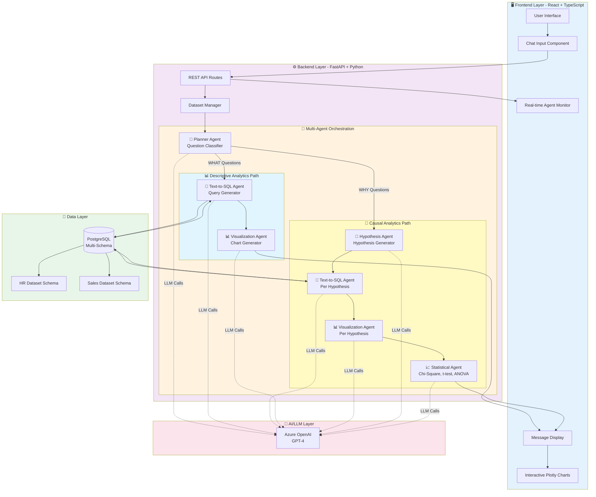
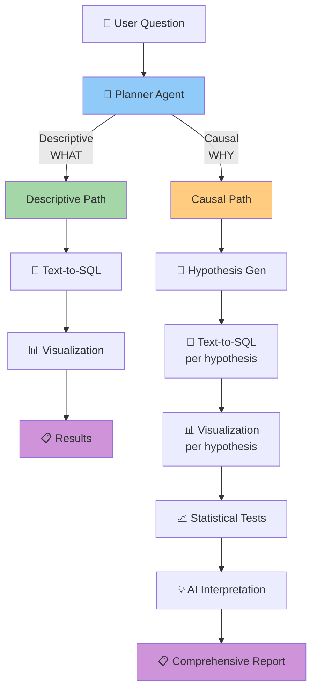
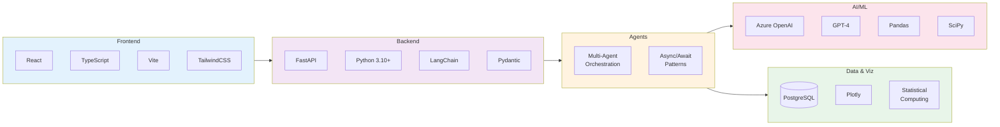
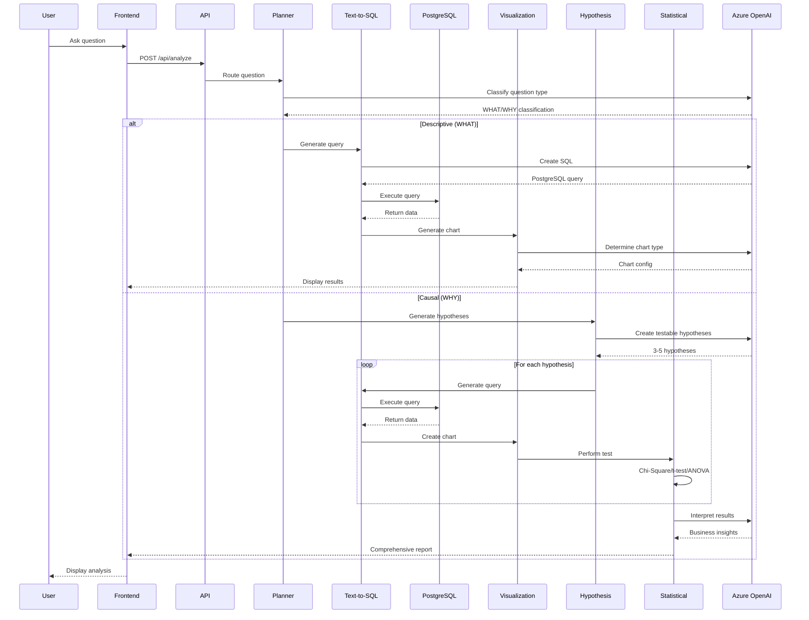
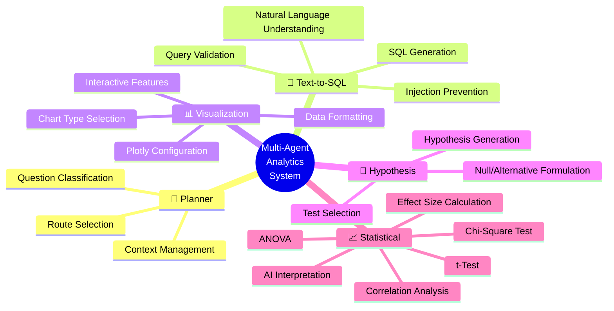
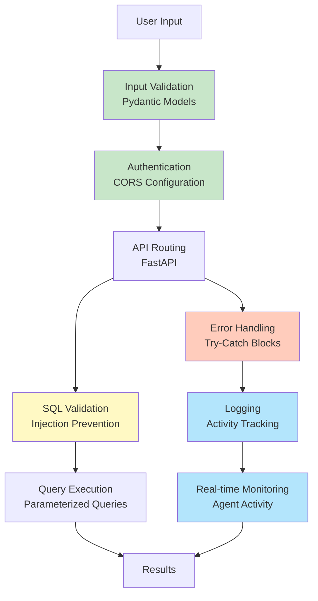

# Architecture Diagrams for Portfolio

## 1. Complete System Architecture



---

## 2. Simplified Agent Flow



---

## 3. Technology Stack Layers



---

## 4. Data Flow Sequence



---

## 5. Agent Responsibilities



---

## 6. Security & Quality Layers



---

## How to Use These Diagrams

### For GitHub/Documentation
- These Mermaid diagrams render automatically on GitHub
- Copy the diagram code blocks to your README.md or documentation

### For Presentations/Portfolio
1. **Render to Image**: Use [Mermaid Live Editor](https://mermaid.live) to convert to PNG/SVG
2. **Copy the image** to your portfolio website
3. **Or use a Mermaid renderer** in your React app with `react-mermaid`

### Recommended Uses
- **Diagram 1**: Complete overview for technical documentation
- **Diagram 2**: Simplified flow for portfolio/presentations
- **Diagram 3**: Technology stack visualization
- **Diagram 4**: Sequence diagram for detailed workflow
- **Diagram 5**: Agent responsibilities mindmap
- **Diagram 6**: Security architecture for interviews

---

## Converting to Images

### Online Tools
1. [Mermaid Live Editor](https://mermaid.live) - Copy diagram, export as PNG/SVG
2. [Excalidraw](https://excalidraw.com) - Redraw for hand-drawn style

### CLI Tools
```bash
# Install mermaid-cli
npm install -g @mermaid-js/mermaid-cli

# Convert diagram to image
mmdc -i diagram.mmd -o diagram.png -t dark -b transparent
```

### In React App
```bash
npm install react-mermaid2

# Or use recharts/d3 for custom interactive diagrams
```
