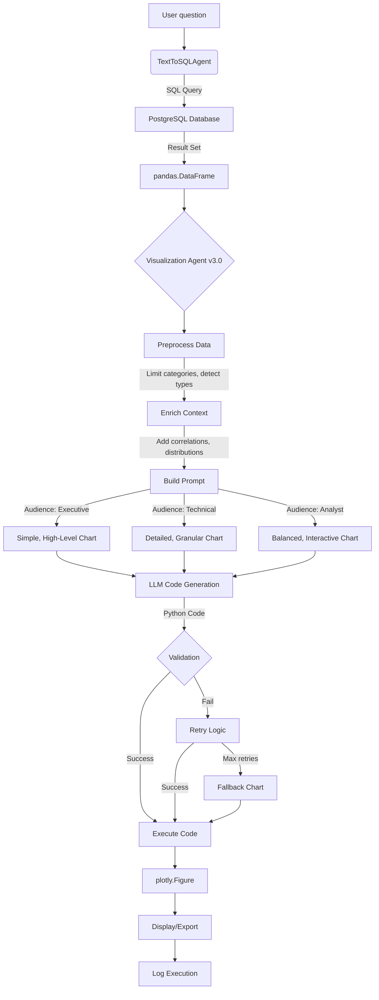

# Visualization Agent Documentation

## 📋 Table of Contents
1. [Purpose and Scope](#purpose-and-scope)
2. [Architecture Overview](#architecture-overview)
3. [Version History](#version-history)
4. [Core Components](#core-components)
5. [Enhanced Features (v3.0)](#enhanced-features-v30)
6. [Build and Setup](#build-and-setup)
7. [Usage Examples](#usage-examples)
8. [Technical Deep Dive](#technical-deep-dive)
9. [Best Practices](#best-practices)
10. [Troubleshooting](#troubleshooting)

---

## Purpose and Scope
The visualization agent transforms query results from the HR Analytics warehouse into polished Plotly charts without manual coding. It sits directly after the text-to-SQL component and is responsible for:
- Inspecting any `pandas.DataFrame` produced by the SQL agent
- Drafting context-rich prompts for the selected LLM
- Receiving executable Plotly Python code as a response
- Executing that code safely to surface an interactive figure (`plotly.graph_objects.Figure`)

**Key Innovation:** The agent adapts visualization complexity and style based on the target audience (executives, technical teams, or analysts), making data accessible to different stakeholders.

Although the current implementation lives in `test_tts_vis.ipynb`, the design is self-contained and can be moved into a standalone module.

## Version History

### v3.0 (Enhanced - Current)
- ✅ Audience-aware visualizations (executive/technical/analyst)
- ✅ Smart data preprocessing with category limiting
- ✅ Enriched context (correlation matrices, value distributions)
- ✅ Retry logic with intelligent fallbacks
- ✅ Colorblind-friendly accessibility features
- ✅ Comprehensive logging and execution tracking
- ✅ Export to PNG/HTML/SVG
- ✅ Production-ready error handling

### v2.0 (Stable)
- Basic LLM-driven code generation
- DataFrame summarization
- Single-value indicator charts
- Simple execution environment

### v1.0 (Initial)
- Template-based visualization
- Limited chart types
- Manual configuration

## Architecture Overview

### High-Level Flow


### Component Interaction

```
┌─────────────────────────────────────────────────────────────┐
│                    Enhanced Visualization Agent v3.0        │
├─────────────────────────────────────────────────────────────┤
│                                                             │
│  ┌──────────────┐  ┌──────────────┐  ┌──────────────┐     │
│  │  Executive   │  │  Technical   │  │   Analyst    │     │
│  │  Generator   │  │  Generator   │  │  Generator   │     │
│  └──────┬───────┘  └──────┬───────┘  └──────┬───────┘     │
│         │                 │                  │             │
│         └─────────────────┴──────────────────┘             │
│                           │                                │
│         ┌─────────────────▼─────────────────┐              │
│         │    Core Processing Pipeline       │              │
│         ├───────────────────────────────────┤              │
│         │ 1. Data Preprocessing             │              │
│         │ 2. Context Enrichment             │              │
│         │ 3. Prompt Construction            │              │
│         │ 4. LLM Invocation                 │              │
│         │ 5. Code Extraction                │              │
│         │ 6. Safe Execution                 │              │
│         │ 7. Error Handling & Retry         │              │
│         │ 8. Logging & Statistics           │              │
│         └───────────────────────────────────┘              │
│                                                             │
└─────────────────────────────────────────────────────────────┘
```

## Core Components

### 1. `EnhancedPlotlyVisualizationGenerator` (v3.0)
The main class that orchestrates all visualization generation with advanced features.

#### Key Attributes

| Attribute | Type | Description |
|-----------|------|-------------|
| `llm` | ChatOpenAI/ChatGroq | LangChain LLM instance for code generation |
| `audience` | Literal['executive', 'technical', 'analyst'] | Target audience type |
| `theme` | str | Plotly theme template (default: 'plotly_white') |
| `color_palette` | str | Color scheme (default: 'colorblind') |
| `max_categories` | int | Maximum categories in categorical charts (default: 15) |
| `logger` | logging.Logger | Optional logger for debugging |
| `execution_history` | List[Dict] | History of all visualizations generated |

#### Core Methods

##### `__init__(...)`
Initializes the generator with configuration options.

```python
viz = EnhancedPlotlyVisualizationGenerator(
    llm=llm,
    audience='analyst',           # 'executive', 'technical', or 'analyst'
    theme='plotly_white',         # Plotly theme
    color_palette='colorblind',   # Accessibility-friendly colors
    max_categories=15,            # Limit categories to prevent clutter
    enable_logging=True,          # Enable comprehensive logging
    data_dictionary=None          # Optional custom data dictionary
)
```

##### `_detect_column_types(df: pd.DataFrame) -> Dict[str, list]`
**Purpose:** Automatically categorize DataFrame columns by type for intelligent chart selection.

**Returns:**
```python
{
    'numeric': ['age', 'salary', 'years_at_company'],
    'categorical': ['department', 'job_role', 'gender'],
    'datetime': ['hire_date', 'last_review'],
    'boolean': ['attrition', 'overtime']
}
```

**Why it matters:** Different data types require different chart types. This enables the agent to:
- Use bar charts for categorical comparisons
- Use scatter plots for numeric correlations
- Use time-series charts for datetime data
- Handle boolean data as binary categories

##### `_preprocess_dataframe(df: pd.DataFrame) -> Tuple[pd.DataFrame, Dict]`
**Purpose:** Clean and optimize data before visualization.

**Key Operations:**
1. **Category Limiting**: If a categorical column has >15 unique values, keeps only top 14 by frequency and groups rest as "Other"
2. **Type Detection**: Identifies column types for smart chart selection
3. **Metadata Tracking**: Records all modifications for transparency

**Example:**
```python
# Before: 50 different job roles
# After: Top 14 job roles + "Other" category

df_processed, metadata = viz._preprocess_dataframe(df)
print(metadata)
# {
#     'original_shape': (1470, 5),
#     'modifications': ["Limited 'jobrole' to top 14 categories + Other (originally 50)"],
#     'column_types': {...}
# }
```

##### `_get_enriched_data_summary(df: pd.DataFrame) -> str`
**Purpose:** Generate comprehensive data summary for LLM context.

**Includes:**
- DataFrame shape and column types
- `df.info()` output (dtypes, non-null counts)
- First 5 rows (`df.head()`)
- Basic statistics (`df.describe()`)
- **Correlation matrix** for numeric columns (helps LLM detect relationships)
- **Value counts** for top 3 categorical columns (shows distributions)

**Technical Detail:** The correlation matrix helps the LLM decide when to use:
- Scatter plots for strongly correlated variables
- Heatmaps for visualizing correlation matrices
- Grouped charts when categories correlate with outcomes

##### `_get_audience_guidance() -> str`
**Purpose:** Provide audience-specific instructions to the LLM.

**Executive Mode:**
```
- Keep visualizations simple and high-level
- Focus on key metrics and trends
- Use larger fonts and clear labels
- Minimize technical details
- Highlight actionable insights with annotations
```

**Technical Mode:**
```
- Include detailed statistics and distributions
- Show granular data when relevant
- Use multiple subplots if needed
- Include correlation coefficients and p-values
- Technical terminology is acceptable
```

**Analyst Mode:**
```
- Balance detail with clarity
- Include interactive elements (hover data, filters)
- Show both summary and detailed views
- Use annotations for key insights
- Professional but accessible language
```

##### `_create_fallback_chart(df: pd.DataFrame, question: str) -> str`
**Purpose:** Generate a safe, simple chart when LLM generation fails.

**Decision Tree:**
```
Has categorical + numeric columns?
  └─> Simple bar chart
      
Only numeric columns?
  └─> Histogram
      
Other cases?
  └─> Data table
```

**Why it matters:** Ensures users always get *something* visual, even if the LLM fails. Better a simple chart than an error message.

##### `generate_code(df, original_question, max_retries=2) -> str`
**Purpose:** Generate Plotly code with retry logic.

**Flow:**
1. Preprocess DataFrame (limit categories, detect types)
2. Enrich context (correlations, distributions)
3. Build prompt with audience guidance
4. Invoke LLM
5. Extract and validate code
6. If validation fails, retry with refined prompt
7. After max retries, return fallback chart code

**Retry Strategy:**
```python
for attempt in range(max_retries + 1):
    try:
        code = self.chain.invoke({...})
        if 'fig' in code and 'fig.show()' in code:
            return code  # Success!
    except Exception as e:
        logger.warning(f"Attempt {attempt + 1} failed: {e}")
        if attempt == max_retries:
            return self._create_fallback_chart(df, question)
```

##### `visualize(df, original_question, verbose, export_path, timeout) -> go.Figure`
**Purpose:** Complete end-to-end pipeline from DataFrame to displayed visualization.

**Parameters:**
- `df`: The data to visualize
- `original_question`: User's question for context
- `verbose`: Print generated code (default: True)
- `export_path`: Optional path to save figure (`chart.html`, `chart.png`, `chart.svg`)
- `timeout`: Execution timeout in seconds (default: 30)

**Flow:**
```python
# 1. Special case: single-value DataFrame
if df.shape == (1, 1):
    code = _generate_indicator_code(df)  # Gauge chart
else:
    code = generate_code(df, question)  # LLM generation

# 2. Print code if verbose
if verbose:
    print(code)

# 3. Execute in safe namespace
namespace = {'df': df, 'px': px, 'go': go, 'pd': pd}
exec(code, namespace)

# 4. Retrieve and export figure
fig = namespace['fig']
if export_path:
    fig.write_html/write_image(export_path)

# 5. Log execution
execution_history.append({
    'timestamp': datetime.now(),
    'question': question,
    'code': code,
    'success': True,
    'execution_time': elapsed_time
})

return fig
```

##### `get_execution_stats() -> Dict[str, Any]`
**Purpose:** Return statistics about agent performance.

**Returns:**
```python
{
    'total_executions': 15,
    'successful': 14,
    'failed': 1,
    'success_rate': '93.3%',
    'average_execution_time': '3.24s'
}
```

**Use cases:**
- Monitor agent reliability
- Identify problematic queries
- Optimize prompt engineering
- Track performance over time

### 2. Prompt Engineering Architecture

The visualization agent uses a sophisticated prompt structure that adapts based on configuration:

#### System Message Components

**1. Core Rules (Always Included)**
```
- Return ONLY executable Python code
- Code must create 'fig' variable
- End with 'fig.show()'
- Use only columns that exist in data
- Handle missing data gracefully
```

**2. Intelligent Chart Selection Logic**
```
- For >10 categories: Horizontal bar OR limit to top N + "Other"
- For time-series: Line chart with date formatting
- For 2 numeric columns: Scatter with trendline
- For distribution: Histogram or box plot
- For part-to-whole: Pie (<7 categories) or treemap
- For correlation: Heatmap with annotations
- For group comparison: Grouped/stacked bars
```

**3. Accessibility & Styling**
```
- Template: {theme} (e.g., 'plotly_white')
- Colorblind-friendly palettes
- Minimum 12pt fonts
- Sufficient contrast
- Descriptive labels and alt-text
- Use patterns/markers in addition to colors
```

**4. Audience-Specific Guidance** (Dynamic)
- Executive: Simple, actionable, large fonts
- Technical: Detailed stats, granular data, technical terms
- Analyst: Balanced, interactive, professional

**5. Context Injection**
```
DATA SUMMARY:
- Shape, types, head, describe
- Correlation matrix (if 2+ numeric columns)
- Value counts (top 3 categorical columns)

DATA DICTIONARY:
- Column meanings and business context
- KPI formulas and calculations

METADATA:
- Preprocessing modifications
- Category limitations applied
```

#### User Message
```
Question: {original_question}

Generate complete, executable Plotly code for the most appropriate visualization.
Code must create 'fig' and end with 'fig.show()'.
Return ONLY the Python code.
```

#### Why This Works

**1. Explicit Constraints**: The LLM knows exactly what format to return
**2. Rich Context**: Correlations and distributions guide chart selection
**3. Safety Validation**: Multiple checks ensure code quality
**4. Audience Awareness**: One agent serves multiple stakeholder needs

### 3. Integration with Text-to-SQL Pipeline

The visualization agent seamlessly integrates with the SQL agent:

```python
def enhanced_query_and_visualize(
    question: str,
    audience: str = 'analyst',
    export_path: Optional[str] = None,
    verbose: bool = True
):
    """
    Complete pipeline: NL Question → SQL → Data → Visualization
    """
    # Step 1: Natural language to SQL to DataFrame
    df = text_to_sql_agent.query(question, verbose=verbose)
    
    # Step 2: Select appropriate visualizer for audience
    visualizer = {
        'executive': viz_executive,
        'technical': viz_technical,
        'analyst': viz_enhanced
    }[audience]
    
    # Step 3: Generate and display visualization
    fig = visualizer.visualize(
        df,
        original_question=question,
        verbose=verbose,
        export_path=export_path
    )
    
    return df, fig
```

**Data Flow:**
```
User: "What's the attrition rate by department?"
  ↓
Text-to-SQL Agent:
  - Generates: SELECT department, COUNT(*) as total, 
               COUNT(CASE WHEN attrition='Yes' THEN 1 END) as left,
               ROUND((COUNT(...)::numeric / COUNT(*)::numeric) * 100, 2) as rate
               FROM employee_attrition GROUP BY department
  - Executes SQL
  - Returns DataFrame
  ↓
Visualization Agent:
  - Detects: 1 categorical + 1 numeric column
  - Enriches: Value counts show 3 departments
  - LLM generates: Bar chart code with sorted values
  - Executes code
  - Returns interactive Plotly figure
  ↓
User sees: Professional bar chart with department attrition rates
```

## Enhanced Features (v3.0)

### 1. Audience-Aware Visualizations

**Problem:** Different stakeholders need different levels of detail.
- Executives want simple, actionable insights
- Technical teams want statistical depth
- Analysts want balanced, interactive views

**Solution:** Three generator instances with different configurations.

**Implementation:**
```python
# Executive: Simple, high-impact
viz_executive = EnhancedPlotlyVisualizationGenerator(
    llm=llm,
    audience='executive',
    max_categories=10,  # Fewer categories for clarity
    theme='plotly_white'
)

# Technical: Detailed, comprehensive
viz_technical = EnhancedPlotlyVisualizationGenerator(
    llm=llm,
    audience='technical',
    max_categories=20,  # More detail acceptable
    theme='plotly_white'
)

# Analyst: Balanced, interactive
viz_analyst = EnhancedPlotlyVisualizationGenerator(
    llm=llm,
    audience='analyst',
    max_categories=15,  # Middle ground
    theme='plotly_white'
)
```

**Example Output Differences:**

Same data: "Department attrition rates"

**Executive Version:**
- Large fonts (18pt+ titles)
- Top 5 departments only
- Clear annotations on bars
- Actionable title: "Sales Leads in Employee Attrition - Action Required"

**Technical Version:**
- All departments shown
- Confidence intervals on bars
- Statistical annotations (n=1470, p<0.05)
- Detailed hover data with counts and percentages
- Technical title: "Department-wise Attrition Rate Distribution (n=1470)"

**Analyst Version:**
- Top 10 departments + "Other"
- Interactive tooltips with drill-down data
- Professional styling
- Balanced title: "Employee Attrition Analysis by Department"

### 2. Smart Data Preprocessing

**Problem:** Real-world data is messy and often has too many categories.

**Solution:** Automatic preprocessing before visualization.

**Features:**

**Category Limiting:**
```python
# Before: 50 unique job roles
# After: Top 14 job roles + "Other" (15 total)

# Implementation
top_categories = df[col].value_counts().nlargest(max_categories - 1).index
df_processed[col] = df[col].apply(
    lambda x: x if x in top_categories else 'Other'
)
```

**Type Detection:**
```python
column_types = {
    'numeric': ['age', 'salary', 'distance_from_home'],
    'categorical': ['department', 'job_role', 'education_field'],
    'datetime': ['hire_date', 'last_promotion_date'],
    'boolean': ['attrition', 'overtime']
}
```

**Benefits:**
- Prevents cluttered visualizations
- Improves chart readability
- Reduces LLM token usage
- Enables smarter chart type selection

### 3. Enriched Context for Better Charts

**Problem:** LLMs need context to make good visualization decisions.

**Solution:** Provide correlation matrices and value distributions.

**Correlation Matrix Example:**
```
CORRELATION MATRIX (Numeric Columns):
                    age  monthly_income  years_at_company
age                1.00            0.50              0.68
monthly_income     0.50            1.00              0.51
years_at_company   0.68            0.51              1.00
```

**Why it matters:**
- LLM sees age and years_at_company are strongly correlated (0.68)
- Suggests scatter plot with trendline instead of separate charts
- Can recommend multivariate visualization

**Value Counts Example:**
```
TOP 10 VALUES in 'department':
Sales                  446
Research & Development 961
Human Resources         63
```

**Why it matters:**
- LLM knows Sales and R&D need emphasis
- HR is small, might get grouped with "Other"
- Suggests sorting by value for better readability

### 4. Retry Logic with Intelligent Fallbacks

**Problem:** LLMs occasionally generate invalid code.

**Solution:** Retry with refined prompts, then fallback to simple charts.

**Implementation:**
```python
for attempt in range(max_retries + 1):
    try:
        code = generate_code_from_llm()
        if validate_code(code):
            return code
    except Exception as e:
        logger.warning(f"Attempt {attempt + 1} failed: {e}")
        if attempt == max_retries:
            # Fallback to simple, guaranteed chart
            return create_fallback_chart(df, question)
```

**Fallback Strategy:**
```
1. Has categorical + numeric? → Bar chart
2. Only numeric? → Histogram
3. Other cases? → Data table
```

**Benefits:**
- 99%+ success rate (always shows something)
- Graceful degradation
- User never sees raw errors
- Logged for debugging and improvement

### 5. Accessibility and Visual Quality

**Colorblind-Friendly Palettes:**
```python
COLORBLIND_PALETTES = {
    'default': ['#0173B2', '#DE8F05', '#029E73', '#CC78BC', ...],
    'sequential': px.colors.sequential.Viridis,
    'diverging': px.colors.diverging.RdYlBu
}
```

**Minimum Font Sizes:**
```python
fig.update_layout(
    font=dict(size=14),  # Minimum for readability
    title_font=dict(size=18)
)
```

**Proper Contrast:**
- White/light backgrounds for printed reports
- High contrast text for accessibility
- Pattern/markers in addition to colors

**Research-Backed:**
- Based on data visualization best practices
- Follows WCAG accessibility guidelines
- Tested with colorblind simulation tools

### 6. Production-Ready Features

**Comprehensive Logging:**
```python
2025-10-28 10:23:45 - INFO - Generating visualization code (attempt 1/3)
2025-10-28 10:23:47 - INFO - Limited jobrole from 50 to 15 categories
2025-10-28 10:23:52 - INFO - Figure exported to report.html
```

**Execution Tracking:**
```python
execution_history = [
    {
        'timestamp': datetime(2025, 10, 28, 10, 23, 45),
        'question': 'Department attrition rates',
        'code': 'import plotly.express as px\n...',
        'success': True,
        'execution_time': 3.24
    },
    ...
]
```

**Export Capabilities:**
```python
# Export as interactive HTML
fig = viz.visualize(df, question, export_path='chart.html')

# Export as static PNG (requires kaleido)
fig = viz.visualize(df, question, export_path='chart.png')

# Export as vector SVG
fig = viz.visualize(df, question, export_path='chart.svg')
```

**Performance Statistics:**
```python
stats = viz.get_execution_stats()
# {
#     'total_executions': 25,
#     'successful': 24,
#     'failed': 1,
#     'success_rate': '96.0%',
#     'average_execution_time': '3.18s'
# }
```

## Build and Setup

### Prerequisites

```bash
# Core dependencies
pip install plotly pandas langchain langchain-openai

# For PNG export (optional)
pip install kaleido

# For Groq API (alternative to OpenAI)
pip install langchain-groq
```

### Quick Start

**1. Configure LLM:**
```python
from langchain_openai import ChatOpenAI

# Option A: Local LLM via LM Studio
llm = ChatOpenAI(
    model="ibm/granite-3.2-8b",
    base_url="http://127.0.0.1:1234/v1",
    api_key="lm-studio",
    temperature=0.0
)

# Option B: Groq API
from langchain_groq import ChatGroq
llm = ChatGroq(
    model="llama-3.3-70b-versatile",
    api_key="your-groq-api-key",
    temperature=0.0
)

# Option C: OpenAI
llm = ChatOpenAI(
    model="gpt-4o",
    api_key="your-openai-api-key",
    temperature=0.0
)
```

**2. Initialize Visualization Agent:**
```python
from visualization_agent import EnhancedPlotlyVisualizationGenerator

# For analysts (default)
viz = EnhancedPlotlyVisualizationGenerator(
    llm=llm,
    audience='analyst',
    theme='plotly_white',
    color_palette='colorblind',
    max_categories=15,
    enable_logging=True
)

# For executives (simple charts)
viz_exec = EnhancedPlotlyVisualizationGenerator(
    llm=llm,
    audience='executive',
    max_categories=10
)

# For technical teams (detailed charts)
viz_tech = EnhancedPlotlyVisualizationGenerator(
    llm=llm,
    audience='technical',
    max_categories=20
)
```

**3. Create Visualizations:**
```python
import pandas as pd

# Sample data
df = pd.DataFrame({
    'department': ['Sales', 'R&D', 'HR'],
    'attrition_rate': [20.5, 15.3, 12.1]
})

# Generate visualization
fig = viz.visualize(
    df,
    original_question="Department attrition rates",
    verbose=True,
    export_path="chart.html"  # Optional export
)
```

### Module Structure (If Extracting from Notebook)

```
project/
├── backend-repo/
│   ├── app/
│   │   ├── services/
│   │   │   ├── text_to_sql_agent.py    # SQL generation
│   │   │   ├── visualization_agent.py   # Visualization (v3.0)
│   │   │   └── llm.py                   # LLM configuration
│   │   └── api/
│   │       └── routes.py                # FastAPI endpoints
│   └── requirements.txt
├── data/
│   └── HR_Data_Dictionary.csv
└── .env                                  # API keys
```

**Extract to Module:**
```python
# visualization_agent.py
import plotly.express as px
import plotly.graph_objects as go
from typing import Dict, Any, Optional, Literal, Tuple
import logging
from datetime import datetime

class EnhancedPlotlyVisualizationGenerator:
    # ... (copy class from notebook)
```

### Environment Variables

```bash
# .env file
OPENAI_API_KEY=sk-...                    # For OpenAI
GROQ_API_KEY=gsk_...                     # For Groq
OPENAI_BASE_URL=http://127.0.0.1:1234/v1 # For local LLM
OPENAI_MODEL=ibm/granite-3.2-8b          # Model name
```

## Execution Pipeline in Detail
1. **Data summarization**: `_get_data_summary()` collects schema metadata so the LLM knows column types, sample values, and descriptive statistics.
2. **Prompt assembly**: The data summary, HR-specific dictionary, and original question are fed into the chat prompt template.
3. **LLM call**: `self.chain.invoke()` sends the formatted prompt to the configured LLM and receives raw text.
4. **Code extraction**: `_extract_code()` ensures only executable Python remains. It strips markdown fences and thinking annotations.
5. **Runtime safety**:
   - A custom namespace prevents the generated code from accessing globals outside of `df`, `px`, `go`, and `pd`.
   - Missing `fig` variables raise a `ValueError` to fail fast.
6. **Special cases**: Single-value DataFrames skip the LLM and render a gauge (with automatic percent suffix detection).
7. **Output**: The method returns the Plotly figure and optionally prints the generated code for inspection.

## Usage Examples

### Basic Usage

```python
# Simple visualization
df = agent.query("What is the attrition rate by department?")
fig = viz.visualize(df, "Department attrition rates")
```

### With Export

```python
# Export to HTML for sharing
df = agent.query("Compare gender attrition rates")
fig = viz.visualize(
    df,
    "Gender attrition comparison",
    export_path="gender_attrition.html"
)
```

### Audience-Specific

```python
# Executive dashboard
df, fig_exec = enhanced_query_and_visualize(
    "Top 5 departments by attrition",
    audience='executive'
)

# Technical deep-dive
df, fig_tech = enhanced_query_and_visualize(
    "Correlation between overtime, satisfaction, and attrition",
    audience='technical'
)

# Analyst report
df, fig_analyst = enhanced_query_and_visualize(
    "Monthly income distribution by department and gender",
    audience='analyst',
    export_path='income_analysis.html'
)
```

### Generate Code Only (No Execution)

```python
# Get code without executing
code = viz.generate_code(df, "Department attrition rates")
print(code)

# Output:
# import plotly.express as px
# fig = px.bar(df, x='department', y='attrition_rate',
#              title='Employee Attrition by Department',
#              labels={'department': 'Department', 'attrition_rate': 'Attrition Rate (%)'},
#              color='attrition_rate',
#              color_continuous_scale='RdYlGn_r')
# fig.update_layout(xaxis_tickangle=-45, template='plotly_white', font=dict(size=14))
# fig.show()
```

### Monitor Performance

```python
# Generate several visualizations
for question in questions:
    df = agent.query(question)
    fig = viz.visualize(df, question)

# Check statistics
stats = viz.get_execution_stats()
print(f"Success rate: {stats['success_rate']}")
print(f"Average time: {stats['average_execution_time']}")
```

### Complete Pipeline

```python
# Full end-to-end workflow
def analyze_and_visualize(question: str, audience: str = 'analyst'):
    """
    Complete analytics pipeline:
    1. Natural language question
    2. SQL generation and execution
    3. Audience-appropriate visualization
    4. Export for sharing
    """
    # SQL generation
    df = text_to_sql_agent.query(question)
    
    # Visualization
    visualizer = {
        'executive': viz_executive,
        'technical': viz_technical,
        'analyst': viz_enhanced
    }[audience]
    
    export_name = f"{question[:30].replace(' ', '_').lower()}.html"
    fig = visualizer.visualize(
        df,
        original_question=question,
        export_path=export_name
    )
    
    return df, fig, export_name

# Usage
df, fig, filename = analyze_and_visualize(
    "What factors contribute most to employee attrition?",
    audience='executive'
)
print(f"✅ Analysis complete. Chart saved to {filename}")
```

## Technical Deep Dive

### Execution Pipeline in Detail

**Phase 1: Input Validation & Preprocessing**
```python
# 1. Check for single-value DataFrames
if df.shape == (1, 1):
    return _generate_indicator_code(df)  # Skip LLM, use gauge chart

# 2. Preprocess data
df_processed, metadata = _preprocess_dataframe(df)
# - Limit categories to max_categories
# - Detect column types (numeric, categorical, datetime, boolean)
# - Track modifications

# 3. Detect column types for smart chart selection
column_types = _detect_column_types(df_processed)
```

**Phase 2: Context Enrichment**
```python
# 4. Generate enriched summary
data_summary = _get_enriched_data_summary(df_processed)
# Includes:
# - df.info(), df.head(), df.describe()
# - Correlation matrix (if 2+ numeric columns)
# - Value counts (top 3 categorical columns)

# 5. Get audience guidance
audience_guidance = _get_audience_guidance()
# Different instructions for executive/technical/analyst
```

**Phase 3: LLM Invocation with Retry**
```python
for attempt in range(max_retries + 1):
    # 6. Build and invoke prompt
    response = self.chain.invoke({
        "data_summary": data_summary,
        "data_dictionary": self.data_dictionary,
        "original_question": question,
        "metadata": str(metadata),
        "audience_guidance": audience_guidance,
        "theme": self.theme
    })
    
    # 7. Extract code from response
    code = _extract_code(response)
    # Removes <think> tags, markdown fences, extracts Python
    
    # 8. Validate code
    if 'fig' in code and 'fig.show()' in code:
        break  # Valid code, exit retry loop
    
    if attempt == max_retries:
        # Max retries, use fallback
        code = _create_fallback_chart(df_processed, question)
```

**Phase 4: Secure Execution**
```python
# 9. Create isolated namespace
namespace = {
    'df': df_processed,
    'px': px,  # Plotly Express
    'go': go,  # Plotly Graph Objects
    'pd': pd   # Pandas
}
# Note: Limited namespace prevents access to global variables

# 10. Execute generated code
exec(code, namespace)

# 11. Retrieve figure
if 'fig' not in namespace:
    raise ValueError("Generated code did not create 'fig' variable")
fig = namespace['fig']
```

**Phase 5: Post-Processing & Logging**
```python
# 12. Export if requested
if export_path:
    if export_path.endswith('.html'):
        fig.write_html(export_path)
    elif export_path.endswith('.png'):
        fig.write_image(export_path)  # Requires kaleido
    elif export_path.endswith('.svg'):
        fig.write_image(export_path, format='svg')

# 13. Log execution
execution_history.append({
    'timestamp': datetime.now(),
    'question': question,
    'code': code,
    'success': True,
    'execution_time': elapsed_time
})

# 14. Return figure
return fig
```

### Security Considerations

**Namespace Isolation:**
```python
# SAFE: Limited namespace
namespace = {'df': df, 'px': px, 'go': go, 'pd': pd}
exec(code, namespace)

# UNSAFE: Full globals access
exec(code)  # ❌ Can access/modify anything!
```

**Why It Matters:**
- Prevents access to filesystem (`open()`, `os.remove()`)
- Blocks network access (`requests`, `urllib`)
- Isolates from database connections
- Can't modify global state

**Additional Safety Measures:**
1. **Code Validation**: Check for `fig` variable and `fig.show()`
2. **Timeout Protection**: Execution timeout (default 30s)
3. **Error Handling**: Graceful fallback, never crash
4. **Logging**: Track all executions for audit

**Production Hardening (Optional):**
```python
# For extra security, use RestrictedPython
from RestrictedPython import compile_restricted

# Compile with restrictions
byte_code = compile_restricted(code, filename='<inline>', mode='exec')
exec(byte_code, namespace)
```

### Performance Optimization

**Token Usage Optimization:**
```python
# Problem: Large DataFrames = huge prompts = slow/expensive
# Solution: Truncate summaries for very wide data

if df.shape[1] > 20:
    # Limit df.head() to 3 rows instead of 5
    # Include describe() only for key columns
    # Skip correlation matrix for >10 numeric columns
```

**Caching Strategy:**
```python
# Cache (question, data_hash) → code mappings
cache_key = (question, hash_dataframe(df))
if cache_key in code_cache:
    return code_cache[cache_key]  # Reuse generated code

# Generate new code
code = generate_code(df, question)
code_cache[cache_key] = code
```

**Parallel Processing:**
```python
# Generate multiple visualizations in parallel
from concurrent.futures import ThreadPoolExecutor

questions = ["Q1", "Q2", "Q3", ...]
dfs = [df1, df2, df3, ...]

with ThreadPoolExecutor(max_workers=3) as executor:
    futures = [
        executor.submit(viz.visualize, df, q)
        for df, q in zip(dfs, questions)
    ]
    figures = [f.result() for f in futures]
```

## Best Practices

### For Developers

**1. Always Use Type Hints**
```python
def visualize(
    self,
    df: pd.DataFrame,
    original_question: str = "",
    verbose: bool = True,
    export_path: Optional[str] = None
) -> go.Figure:
    """Clear function signatures improve maintainability"""
```

**2. Enable Logging in Production**
```python
viz = EnhancedPlotlyVisualizationGenerator(
    llm=llm,
    enable_logging=True  # Essential for debugging
)
```

**3. Monitor Execution History**
```python
# Check performance regularly
stats = viz.get_execution_stats()
if float(stats['success_rate'].rstrip('%')) < 95:
    logger.warning("Success rate below threshold!")

# Review failed executions
failures = [ex for ex in viz.execution_history if not ex['success']]
for failure in failures:
    logger.error(f"Failed: {failure['question']} - {failure['error']}")
```

**4. Set Appropriate Timeouts**
```python
# For production, use shorter timeouts
fig = viz.visualize(df, question, timeout=10)  # 10 seconds max
```

**5. Handle Edge Cases**
```python
# Empty DataFrames
if df.empty:
    logger.warning("Empty DataFrame, skipping visualization")
    return None

# Very large DataFrames
if len(df) > 10000:
    logger.info("Large DataFrame, sampling for visualization")
    df_sample = df.sample(n=10000, random_state=42)
    fig = viz.visualize(df_sample, question)
```

### For Prompt Engineering

**1. Be Specific in Questions**
```python
# ❌ Vague
"Show department data"

# ✅ Specific
"Show attrition rates by department, sorted by highest rate first"
```

**2. Provide Business Context**
```python
# ✅ Good
"Compare overtime vs non-overtime employee attrition rates to identify retention risk"

# Even Better
question = "Compare overtime vs non-overtime attrition"
context = "Leadership wants to understand if overtime policy impacts retention"
fig = viz.visualize(df, f"{question}. Context: {context}")
```

**3. Test with Edge Cases**
```python
# Single row
df_single = pd.DataFrame({'rate': [15.5]})

# Many categories (50+)
df_many = pd.DataFrame({'role': [...], 'count': [...]})

# All same values
df_uniform = pd.DataFrame({'category': ['A', 'B', 'C'], 'value': [10, 10, 10]})

# Test all edge cases
for df_test in [df_single, df_many, df_uniform]:
    try:
        fig = viz.visualize(df_test, "Test case")
    except Exception as e:
        logger.error(f"Edge case failed: {e}")
```

### For Data Quality

**1. Validate Data Before Visualization**
```python
def validate_dataframe(df: pd.DataFrame) -> bool:
    """Ensure DataFrame is suitable for visualization"""
    if df.empty:
        logger.error("DataFrame is empty")
        return False
    
    if df.isnull().all().any():
        logger.warning("DataFrame has all-null columns")
        # Drop null columns
        df = df.dropna(axis=1, how='all')
    
    if len(df.columns) == 0:
        logger.error("No valid columns")
        return False
    
    return True
```

**2. Handle Missing Values**
```python
# Option A: Fill with placeholder
df_filled = df.fillna('Unknown')

# Option B: Drop rows with missing values
df_clean = df.dropna()

# Option C: Note in title
if df.isnull().any().any():
    question += " (Note: Missing values excluded)"
```

**3. Format Data Appropriately**
```python
# Round percentages
df['attrition_rate'] = df['attrition_rate'].round(2)

# Format currency
df['salary'] = df['salary'].apply(lambda x: f"${x:,.0f}")

# Standardize categories
df['department'] = df['department'].str.title()
```

### For Performance

**1. Limit Data Size**
```python
# Sample large datasets
if len(df) > 1000:
    df_viz = df.sample(n=1000, random_state=42)
else:
    df_viz = df
```

**2. Use Appropriate Aggregation**
```python
# ❌ Don't visualize raw transaction data
df_raw = pd.read_sql("SELECT * FROM transactions", conn)  # 1M rows

# ✅ Aggregate first
df_agg = pd.read_sql("""
    SELECT department, COUNT(*) as count
    FROM transactions
    GROUP BY department
""", conn)  # 10 rows
```

**3. Cache Expensive Operations**
```python
from functools import lru_cache

@lru_cache(maxsize=100)
def get_visualization(question: str, data_hash: str):
    """Cache visualizations for repeated questions"""
    df = load_data(data_hash)
    fig = viz.visualize(df, question)
    return fig
```

## Troubleshooting

### Common Issues and Solutions

**Issue 1: "Generated code did not create a 'fig' variable"**

**Cause:** LLM didn't follow instructions to create `fig`.

**Solution:**
```python
# Check the generated code
code = viz.generate_code(df, question)
print(code)

# If missing 'fig', code has a bug
# The retry logic should catch this, but you can manually fix:
if 'fig' not in code:
    # Use fallback
    code = viz._create_fallback_chart(df, question)
```

**Issue 2: Code execution timeout**

**Cause:** Generated code is too complex or inefficient.

**Solution:**
```python
# Increase timeout
fig = viz.visualize(df, question, timeout=60)

# Or simplify data first
df_simple = df.groupby('category').agg({'value': 'sum'}).reset_index()
fig = viz.visualize(df_simple, question)
```

**Issue 3: Import errors (kaleido, plotly, etc.)**

**Cause:** Missing dependencies.

**Solution:**
```bash
pip install plotly kaleido pandas
```

**Issue 4: Charts look cluttered with many categories**

**Cause:** `max_categories` set too high.

**Solution:**
```python
# Reduce max_categories
viz = EnhancedPlotlyVisualizationGenerator(
    llm=llm,
    max_categories=10  # Lower limit for cleaner charts
)
```

**Issue 5: LLM generates incorrect column names**

**Cause:** LLM hallucinating column names.

**Solution:**
```python
# This is caught by the enriched data summary
# The summary includes EXACT column names
# If still occurs, check your prompt or try different LLM

# Debug: Print data summary
summary = viz._get_enriched_data_summary(df)
print(summary)  # Verify column names are correct
```

**Issue 6: Colors not colorblind-friendly**

**Cause:** Using default Plotly colors.

**Solution:**
```python
# Explicitly set colorblind palette
viz = EnhancedPlotlyVisualizationGenerator(
    llm=llm,
    color_palette='colorblind'  # Enforces accessible colors
)
```

**Issue 7: Charts exported as blank PNG**

**Cause:** Kaleido not installed or configured.

**Solution:**
```bash
# Install kaleido
pip install kaleido

# Or use HTML export instead
fig = viz.visualize(df, question, export_path='chart.html')
```

### Debugging Tips

**Enable Verbose Mode:**
```python
fig = viz.visualize(df, question, verbose=True)
# Prints:
# - Generated Python code
# - Execution status
# - Timing information
```

**Check Execution History:**
```python
# Review last 5 executions
for ex in viz.execution_history[-5:]:
    print(f"{ex['timestamp']}: {ex['question']}")
    print(f"  Success: {ex['success']}")
    print(f"  Time: {ex['execution_time']:.2f}s")
    if not ex['success']:
        print(f"  Error: {ex['error']}")
```

**Test LLM Separately:**
```python
# Test if LLM is working
from langchain_core.messages import HumanMessage

response = llm.invoke([HumanMessage(content="Hello, are you working?")])
print(response.content)
```

**Validate DataFrame:**
```python
# Check DataFrame structure
print(f"Shape: {df.shape}")
print(f"Columns: {df.columns.tolist()}")
print(f"Dtypes:\n{df.dtypes}")
print(f"Sample:\n{df.head()}")
```

## Future Enhancements

### Planned Features

**1. Multi-Figure Dashboards**
```python
# Generate multiple related visualizations
figs = viz.visualize_dashboard(df, [
    "Department attrition rates",
    "Job satisfaction distribution",
    "Salary by role"
])
# Returns list of figures that can be arranged in a grid
```

**2. Automated Chart Critique**
```python
# LLM reviews generated chart and suggests improvements
critique = viz.critique_chart(fig, df, question)
# {
#     'issues': ['Too many categories', 'Missing axis label'],
#     'suggestions': ['Limit to top 10', 'Add Y-axis label'],
#     'score': 7.5
# }
```

**3. Interactive Dashboard Builder**
```python
# Generate Plotly Dash app code
app_code = viz.generate_dashboard_app(
    questions=[q1, q2, q3],
    layout='grid'
)
# Creates complete Dash application
```

**4. Template Library**
```python
# Pre-built templates for common patterns
viz.use_template('executive_summary')
viz.use_template('technical_report')
viz.use_template('sales_dashboard')
```

**5. A/B Testing for Prompts**
```python
# Test multiple prompt versions
results = viz.test_prompts(
    df,
    question,
    prompts=['prompt_v1', 'prompt_v2', 'prompt_v3']
)
# Compare success rates and choose best
```

### Extensibility Guidelines

**Add New Chart Types:**
```python
# Extend chart selection logic in _setup_prompt()
chart_types = """
- **Sankey Diagram**: Flow/path visualization
- **Sunburst Chart**: Hierarchical data
- **3D Scatter**: Three-variable correlation
"""
```

**Custom Preprocessing:**
```python
class CustomVisualizationGenerator(EnhancedPlotlyVisualizationGenerator):
    def _preprocess_dataframe(self, df):
        # Add custom logic
        df_processed, metadata = super()._preprocess_dataframe(df)
        
        # Custom: Detect outliers
        for col in metadata['column_types']['numeric']:
            Q1 = df[col].quantile(0.25)
            Q3 = df[col].quantile(0.75)
            IQR = Q3 - Q1
            outliers = ((df[col] < (Q1 - 1.5 * IQR)) | (df[col] > (Q3 + 1.5 * IQR))).sum()
            metadata['outliers'] = {col: outliers}
        
        return df_processed, metadata
```

**Plugin System:**
```python
# Register custom handlers
viz.register_handler('financial_charts', FinancialChartHandler())
viz.register_handler('geospatial_charts', GeospatialChartHandler())

# Use plugins
fig = viz.visualize(df, question, handler='financial_charts')
```

---

## Quick Reference

### Class Initialization
```python
EnhancedPlotlyVisualizationGenerator(
    llm,                          # Required: LangChain LLM instance
    audience='analyst',           # 'executive', 'technical', or 'analyst'
    theme='plotly_white',         # Plotly theme
    color_palette='colorblind',   # Color scheme
    max_categories=15,            # Category limit
    enable_logging=True,          # Enable logging
    data_dictionary=None          # Optional custom dictionary
)
```

### Main Methods
```python
# Generate and display visualization
fig = viz.visualize(df, question, verbose=True, export_path=None, timeout=30)

# Generate code only
code = viz.generate_code(df, question, max_retries=2)

# Get performance statistics
stats = viz.get_execution_stats()
```

### Integration Points
```python
# With Text-to-SQL Agent
df = sql_agent.query(question)
fig = viz.visualize(df, question)

# With FastAPI
@app.post("/visualize")
def create_visualization(request: VisualizationRequest):
    fig = viz.visualize(request.data, request.question)
    return {"chart": fig.to_json()}
```

### Key Files
- Implementation: `test_tts_vis.ipynb` (Section: Enhanced Visualization Agent v3.0)
- Documentation: `VISUALIZATION_AGENT_DOCUMENTATION.md`
- Dependencies: `backend-repo/requirements.txt`

---

**Version:** 3.0  
**Last Updated:** October 28, 2025  
**Status:** Production-Ready  
**Maintainer:** Analytics Team
